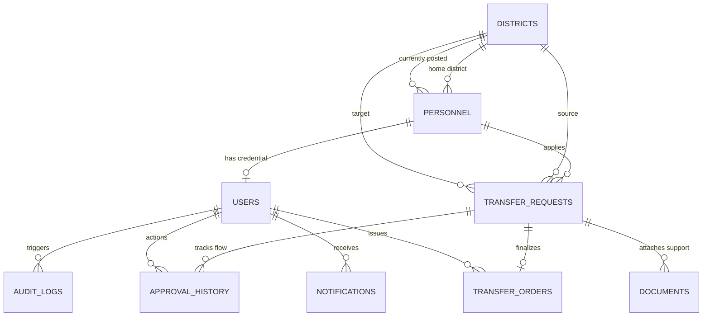

# DATABASE.md

## Database: PostgreSQL

---

## 1. Complete Database Schema (DDL)

```sql
-- 1. Create Enums for State Consistency
CREATE TYPE grade_enum AS ENUM (
    'GRADE_A', 
    'GRADE_B'
);

CREATE TYPE role_enum AS ENUM (
    'COMPUTER_OPERATOR', 
    'DISTRICT_SP', 
    'SP_COMPUTER_CENTRE', 
    'ADG_TECHNICAL_SERVICES', 
    'ADMIN'
);

CREATE TYPE request_status_enum AS ENUM (
    'DRAFT', 
    'PENDING', 
    'APPROVED', 
    'REJECTED', 
    'RETURNED'
);

CREATE TYPE workflow_stage_enum AS ENUM (
    'DRAFT',
    'DISTRICT_SP_REVIEW', 
    'SP_CC_REVIEW', 
    'ADG_TS_REVIEW', 
    'APPROVED', 
    'REJECTED'
);

CREATE TYPE approval_action_enum AS ENUM (
    'SUBMIT', 
    'RECOMMEND', 
    'VERIFY', 
    'APPROVE', 
    'REJECT', 
    'RETURN'
);

-- 2. Master Table: Districts
-- Stores details of the 75 districts in Uttar Pradesh where personnel are posted.
CREATE TABLE districts (
    district_id UUID PRIMARY KEY DEFAULT gen_random_uuid(),
    district_name VARCHAR(100) UNIQUE NOT NULL,
    district_code VARCHAR(10) UNIQUE NOT NULL,
    created_at TIMESTAMP WITH TIME ZONE DEFAULT CURRENT_TIMESTAMP
);

-- 3. Core Table: Personnel
-- Profile data for Computer Operators (Grade A and B) under Technical Services.
CREATE TABLE personnel (
    personnel_id UUID PRIMARY KEY DEFAULT gen_random_uuid(),
    pno VARCHAR(50) UNIQUE NOT NULL, -- PNO number (Unique identification number)
    name VARCHAR(150) NOT NULL,
    grade grade_enum NOT NULL, -- Grade A / B
    designation VARCHAR(100) NOT NULL CHECK (designation IN ('Computer Operator Grade A', 'Computer Operator Grade B')),
    date_of_birth DATE NOT NULL,
    joining_date DATE NOT NULL,
    home_district_id UUID NOT NULL REFERENCES districts(district_id) ON DELETE RESTRICT, -- Cannot be transferred to home district
    current_district_id UUID NOT NULL REFERENCES districts(district_id) ON DELETE RESTRICT,
    current_posting VARCHAR(200) NOT NULL, -- e.g., 'Police Station Hazratganj', 'District Cyber Cell'
    mobile_number VARCHAR(15) UNIQUE NOT NULL,
    email VARCHAR(150) UNIQUE NOT NULL,
    status VARCHAR(50) DEFAULT 'ACTIVE' CHECK (status IN ('ACTIVE', 'SUSPENDED', 'RETIRED')),
    created_at TIMESTAMP WITH TIME ZONE DEFAULT CURRENT_TIMESTAMP,
    updated_at TIMESTAMP WITH TIME ZONE DEFAULT CURRENT_TIMESTAMP
);

-- 4. Core Table: Users
-- System accounts. Personnel table is referenced for Operators. SPs and ADG accounts are created directly.
CREATE TABLE users (
    user_id UUID PRIMARY KEY DEFAULT gen_random_uuid(),
    personnel_id UUID UNIQUE REFERENCES personnel(personnel_id) ON DELETE CASCADE, -- NULL for non-operator administrative users
    district_id UUID REFERENCES districts(district_id) ON DELETE RESTRICT, -- Jurisdiction for DISTRICT_SP (NULL for HQ roles)
    username VARCHAR(100) UNIQUE NOT NULL, -- Maps to PNO for operators
    password_hash VARCHAR(255) NOT NULL,
    email VARCHAR(150) UNIQUE NOT NULL, -- Duplicated/specified for admin direct login routing
    mobile_number VARCHAR(15) UNIQUE NOT NULL,
    role role_enum NOT NULL,
    status VARCHAR(20) DEFAULT 'ACTIVE' CHECK (status IN ('ACTIVE', 'INACTIVE', 'LOCKED')),
    failed_login_attempts INT DEFAULT 0,
    lockout_until TIMESTAMP WITH TIME ZONE,
    otp_code VARCHAR(6),
    otp_expires_at TIMESTAMP WITH TIME ZONE,
    created_at TIMESTAMP WITH TIME ZONE DEFAULT CURRENT_TIMESTAMP,
    updated_at TIMESTAMP WITH TIME ZONE DEFAULT CURRENT_TIMESTAMP
);

-- 5. Core Table: Transfer Requests
-- Records transfer request details from application submission through decisions.
CREATE TABLE transfer_requests (
    request_id UUID PRIMARY KEY DEFAULT gen_random_uuid(),
    personnel_id UUID NOT NULL REFERENCES personnel(personnel_id) ON DELETE RESTRICT,
    source_district_id UUID NOT NULL REFERENCES districts(district_id) ON DELETE RESTRICT,
    target_district_id UUID NOT NULL REFERENCES districts(district_id) ON DELETE RESTRICT,
    transfer_category VARCHAR(100) NOT NULL, -- e.g., 'MEDICAL', 'COMPASSIONATE', 'GENERAL', 'SPOUSE_CASE'
    reason TEXT NOT NULL,
    current_stage workflow_stage_enum DEFAULT 'DRAFT',
    status request_status_enum DEFAULT 'DRAFT',
    application_date TIMESTAMP WITH TIME ZONE,
    created_at TIMESTAMP WITH TIME ZONE DEFAULT CURRENT_TIMESTAMP,
    updated_at TIMESTAMP WITH TIME ZONE DEFAULT CURRENT_TIMESTAMP,
    -- Business logic constraints
    CONSTRAINT chk_different_districts CHECK (source_district_id <> target_district_id)
);

-- 6. Core Table: Documents
-- Stores uploaded files supporting the transfer request. (Supports multiple uploads per request)
CREATE TABLE documents (
    document_id UUID PRIMARY KEY DEFAULT gen_random_uuid(),
    request_id UUID NOT NULL REFERENCES transfer_requests(request_id) ON DELETE CASCADE,
    file_name VARCHAR(255) NOT NULL,
    file_path VARCHAR(512) NOT NULL,
    file_size INT NOT NULL, -- in bytes
    mime_type VARCHAR(100) NOT NULL,
    uploaded_at TIMESTAMP WITH TIME ZONE DEFAULT CURRENT_TIMESTAMP
);

-- 7. Core Table: Approval History (Audit Trail)
-- Logs every action taken on an application. Immutable once inserted.
CREATE TABLE approval_history (
    approval_id UUID PRIMARY KEY DEFAULT gen_random_uuid(),
    request_id UUID NOT NULL REFERENCES transfer_requests(request_id) ON DELETE CASCADE,
    action_by_user_id UUID NOT NULL REFERENCES users(user_id) ON DELETE RESTRICT,
    action approval_action_enum NOT NULL,
    from_stage workflow_stage_enum NOT NULL,
    to_stage workflow_stage_enum NOT NULL,
    remarks TEXT,
    action_ip VARCHAR(45) NOT NULL, -- Audit tracking of reviewer IP
    action_date TIMESTAMP WITH TIME ZONE DEFAULT CURRENT_TIMESTAMP
);

-- 8. Core Table: Transfer Orders
-- Stores output documentation issued following ADG TS approval.
CREATE TABLE transfer_orders (
    order_id UUID PRIMARY KEY DEFAULT gen_random_uuid(),
    request_id UUID UNIQUE NOT NULL REFERENCES transfer_requests(request_id) ON DELETE RESTRICT,
    order_number VARCHAR(100) UNIQUE NOT NULL, -- e.g., 'TS/TR/2026/001'
    order_date DATE NOT NULL DEFAULT CURRENT_DATE,
    pdf_path VARCHAR(512) NOT NULL,
    qr_verification_code VARCHAR(100) UNIQUE NOT NULL, -- Unique hash embedded in QR Code
    issued_by_user_id UUID NOT NULL REFERENCES users(user_id) ON DELETE RESTRICT,
    created_at TIMESTAMP WITH TIME ZONE DEFAULT CURRENT_TIMESTAMP
);

-- 9. Supporting Table: Notifications
-- Stores in-app alerts dispatched to relevant stakeholders during transitions.
CREATE TABLE notifications (
    notification_id UUID PRIMARY KEY DEFAULT gen_random_uuid(),
    user_id UUID NOT NULL REFERENCES users(user_id) ON DELETE CASCADE,
    subject VARCHAR(200) NOT NULL,
    message TEXT NOT NULL,
    read_status BOOLEAN DEFAULT FALSE,
    sent_at TIMESTAMP WITH TIME ZONE DEFAULT CURRENT_TIMESTAMP
);

-- 10. Infrastructure Table: System Audit Logs
-- Tracks critical changes, login actions, and admin actions.
CREATE TABLE audit_logs (
    audit_id UUID PRIMARY KEY DEFAULT gen_random_uuid(),
    user_id UUID REFERENCES users(user_id) ON DELETE SET NULL,
    action_type VARCHAR(100) NOT NULL, -- e.g., 'USER_LOGIN', 'PROFILE_UPDATE', 'WORKFLOW_MUTATION'
    module_name VARCHAR(100) NOT NULL, -- e.g., 'AUTH', 'PERSONNEL', 'TRANSFER'
    details JSONB, -- Dynamic key-value pairs representing action payload or diff changes
    ip_address VARCHAR(45) NOT NULL,
    created_at TIMESTAMP WITH TIME ZONE DEFAULT CURRENT_TIMESTAMP
);

-- 11. Performance Optimization Indexes
CREATE INDEX idx_personnel_pno ON personnel(pno);
CREATE INDEX idx_users_username ON users(username);
CREATE INDEX idx_requests_personnel ON transfer_requests(personnel_id);
CREATE INDEX idx_requests_status_stage ON transfer_requests(status, current_stage);
CREATE INDEX idx_documents_request ON documents(request_id);
CREATE INDEX idx_approval_history_req ON approval_history(request_id);
CREATE INDEX idx_notifications_unread ON notifications(user_id) WHERE read_status = FALSE;
CREATE INDEX idx_audit_logs_created ON audit_logs(created_at DESC);
```

---

## 2. Entity Relationship (ER) Diagram



---

## 3. Relationships and Constraints

1. **Districts $\rightarrow$ Personnel (1:N)**: Enforced via `home_district_id` (home district) and `current_district_id` (posting district). Deleting a district with actively posted or originating personnel is restricted (`ON DELETE RESTRICT`).
2. **Personnel $\rightarrow$ Users (1:1)**: Enforced via unique foreign key `personnel_id` in `users`. Direct administrators (Super Admins, SP CC, ADG TS) do not require a personnel link. Deleting personnel cascades to delete their login user account.
3. **Personnel $\rightarrow$ Transfer Requests (1:N)**: An operator can submit multiple requests over time, but deleting a personnel record is restricted if requests exist (`ON DELETE RESTRICT`).
4. **Districts $\rightarrow$ Transfer Requests (1:N)**: Tracks `source_district_id` and `target_district_id` to establish travel path. Prevented from equal mappings by `chk_different_districts`.
5. **Transfer Requests $\rightarrow$ Documents (1:N)**: Maps one or more files supporting the transfer request. Files are deleted when the request is deleted (`ON DELETE CASCADE`).
6. **Transfer Requests $\rightarrow$ Approval History (1:N)**: Tracks the workflow log step-by-step. Cascades delete on request deletion (`ON DELETE CASCADE`).
7. **Transfer Requests $\rightarrow$ Transfer Orders (1:1)**: Ensures a single order is mapped to one approved request via unique key `request_id`.
8. **Users $\rightarrow$ Notifications (1:N)**: Tracks user-specific inbox alerts. Cascades on user deletion.
9. **Users $\rightarrow$ Audit Logs (1:N)**: Tracked via `user_id`. Set to `NULL` upon user deletion to keep historical audit logs intact.

---

## 4. Seeding Technical Services Personnel Data (seed.sql)

This script populates reference districts, active computer operator profiles, and role-based login credentials.

```sql
-- Districts (UP Police Key Districts)
INSERT INTO districts (district_id, district_name, district_code) VALUES
('e7d3b10b-0dbd-43cf-bc8b-cf4a85208f2a', 'Lucknow', 'LKO'),
('a4a9db98-0f0e-4ab8-9104-9444bb21f37e', 'Kanpur Nagar', 'KAN'),
('f4534f3b-fa0c-4fa8-bc1c-cfdf47ea87c0', 'Gorakhpur', 'GKP'),
('b45efba3-a4c0-482a-a92c-15a452ef72cd', 'Varanasi', 'VAR'),
('c89dfae2-402a-43df-bc7a-594248ef72ba', 'Prayagraj', 'PRG'),
('d78cfba1-8f0a-429a-9e12-429a98ef72be', 'Ghaziabad', 'GZB');

-- Personnel Profiles (Grade A & B Computer Operators under Tech Services)
INSERT INTO personnel (personnel_id, pno, name, grade, designation, date_of_birth, joining_date, home_district_id, current_district_id, current_posting, mobile_number, email, status) VALUES
-- Operator 1: Amit Kumar (Grade A, Home: Gorakhpur, Posted: Lucknow)
('522dfde5-3b9e-4a6c-b7f5-745c68faedba', 'PNO942050012', 'Amit Kumar', 'GRADE_A', 'Computer Operator Grade A', '1994-08-15', '2018-03-10', 
 'f4534f3b-fa0c-4fa8-bc1c-cfdf47ea87c0', 'e7d3b10b-0dbd-43cf-bc8b-cf4a85208f2a', 'District Computer Centre, Lucknow Lines', '+919876543210', 'amit.kumar@uppolice.gov.in', 'ACTIVE'),

-- Operator 2: Rakesh Singh (Grade B, Home: Kanpur Nagar, Posted: Prayagraj)
('9b7f5ba4-e0c2-48c6-bb4d-616c6dbe5b84', 'PNO952050085', 'Rakesh Singh', 'GRADE_B', 'Computer Operator Grade B', '1995-11-22', '2019-07-15', 
 'a4a9db98-0f0e-4ab8-9104-9444bb21f37e', 'c89dfae2-402a-43df-bc7a-594248ef72ba', 'SSP Office Computer Cell, Prayagraj', '+919876543211', 'rakesh.singh@uppolice.gov.in', 'ACTIVE'),

-- Operator 3: Sita Verma (Grade A, Home: Varanasi, Posted: Ghaziabad)
('234b67fa-3b9e-4a6c-b7f5-234b67faefca', 'PNO962050124', 'Sita Verma', 'GRADE_A', 'Computer Operator Grade A', '1996-04-05', '2020-01-20', 
 'b45efba3-a4c0-482a-a92c-15a452ef72cd', 'd78cfba1-8f0a-429a-9e12-429a98ef72be', 'Cyber Cell, Ghaziabad Police Commissionerate', '+919876543212', 'sita.verma@uppolice.gov.in', 'ACTIVE'),

-- Operator 4: Mohammad Anas (Grade B, Home: Lucknow, Posted: Varanasi)
('745c68fa-e0c2-48c6-bb4d-745c68faedba', 'PNO972050231', 'Mohammad Anas', 'GRADE_B', 'Computer Operator Grade B', '1997-09-30', '2021-06-18', 
 'e7d3b10b-0dbd-43cf-bc8b-cf4a85208f2a', 'b45efba3-a4c0-482a-a92c-15a452ef72cd', 'Computer Section, SP Office Varanasi', '+919876543213', 'mohammad.anas@uppolice.gov.in', 'ACTIVE');

-- Users Logins
-- Password Hash below corresponds to: 'SecurePassword123' (hashed using bcrypt)
INSERT INTO users (user_id, personnel_id, district_id, username, password_hash, email, mobile_number, role, status) VALUES
-- Computer Operator Logins (Mapped to Personnel records)
('c010a104-e0c2-48c6-bb4d-616c6dbe5b01', '522dfde5-3b9e-4a6c-b7f5-745c68faedba', NULL, 'PNO942050012', '$2a$12$R9h/lIPzIZf.g3vM1XhJk.f1j2Blyq6yE0MefEwGZ4g.Hk5w6y88S', 'amit.kumar@uppolice.gov.in', '+919876543210', 'COMPUTER_OPERATOR', 'ACTIVE'),
('c010a104-e0c2-48c6-bb4d-616c6dbe5b02', '9b7f5ba4-e0c2-48c6-bb4d-616c6dbe5b84', NULL, 'PNO952050085', '$2a$12$R9h/lIPzIZf.g3vM1XhJk.f1j2Blyq6yE0MefEwGZ4g.Hk5w6y88S', 'rakesh.singh@uppolice.gov.in', '+919876543211', 'COMPUTER_OPERATOR', 'ACTIVE'),
('c010a104-e0c2-48c6-bb4d-616c6dbe5b03', '234b67fa-3b9e-4a6c-b7f5-234b67faefca', NULL, 'PNO962050124', '$2a$12$R9h/lIPzIZf.g3vM1XhJk.f1j2Blyq6yE0MefEwGZ4g.Hk5w6y88S', 'sita.verma@uppolice.gov.in', '+919876543212', 'COMPUTER_OPERATOR', 'ACTIVE'),
('c010a104-e0c2-48c6-bb4d-616c6dbe5b04', '745c68fa-e0c2-48c6-bb4d-745c68faedba', NULL, 'PNO972050231', '$2a$12$R9h/lIPzIZf.g3vM1XhJk.f1j2Blyq6yE0MefEwGZ4g.Hk5w6y88S', 'mohammad.anas@uppolice.gov.in', '+919876543213', 'COMPUTER_OPERATOR', 'ACTIVE'),

-- District SP Logins (One for each current district where operators are posted)
('d010a104-e0c2-48c6-bb4d-616c6dbe5b01', NULL, 'e7d3b10b-0dbd-43cf-bc8b-cf4a85208f2a', 'sp_lucknow', '$2a$12$R9h/lIPzIZf.g3vM1XhJk.f1j2Blyq6yE0MefEwGZ4g.Hk5w6y88S', 'sp.lko@uppolice.gov.in', '+919876543220', 'DISTRICT_SP', 'ACTIVE'),
('d010a104-e0c2-48c6-bb4d-616c6dbe5b02', NULL, 'c89dfae2-402a-43df-bc7a-594248ef72ba', 'sp_prayagraj', '$2a$12$R9h/lIPzIZf.g3vM1XhJk.f1j2Blyq6yE0MefEwGZ4g.Hk5w6y88S', 'sp.prg@uppolice.gov.in', '+919876543221', 'DISTRICT_SP', 'ACTIVE'),
('d010a104-e0c2-48c6-bb4d-616c6dbe5b03', NULL, 'd78cfba1-8f0a-429a-9e12-429a98ef72be', 'sp_ghaziabad', '$2a$12$R9h/lIPzIZf.g3vM1XhJk.f1j2Blyq6yE0MefEwGZ4g.Hk5w6y88S', 'sp.gzb@uppolice.gov.in', '+919876543222', 'DISTRICT_SP', 'ACTIVE'),
('d010a104-e0c2-48c6-bb4d-616c6dbe5b04', NULL, 'b45efba3-a4c0-482a-a92c-15a452ef72cd', 'sp_varanasi', '$2a$12$R9h/lIPzIZf.g3vM1XhJk.f1j2Blyq6yE0MefEwGZ4g.Hk5w6y88S', 'sp.var@uppolice.gov.in', '+919876543223', 'DISTRICT_SP', 'ACTIVE'),

-- Technical Services Headquarters Administrative Logins
('a010a104-e0c2-48c6-bb4d-616c6dbe5b01', NULL, NULL, 'sp_computer_centre', '$2a$12$R9h/lIPzIZf.g3vM1XhJk.f1j2Blyq6yE0MefEwGZ4g.Hk5w6y88S', 'spcc.hq@uppolice.gov.in', '+919876543224', 'SP_COMPUTER_CENTRE', 'ACTIVE'),
('a010a104-e0c2-48c6-bb4d-616c6dbe5b02', NULL, NULL, 'adg_tech_services', '$2a$12$R9h/lIPzIZf.g3vM1XhJk.f1j2Blyq6yE0MefEwGZ4g.Hk5w6y88S', 'adgts.hq@uppolice.gov.in', '+919876543225', 'ADG_TECHNICAL_SERVICES', 'ACTIVE'),

-- Super Admin Login
('a010a104-e0c2-48c6-bb4d-616c6dbe5b03', NULL, NULL, 'super_admin', '$2a$12$R9h/lIPzIZf.g3vM1XhJk.f1j2Blyq6yE0MefEwGZ4g.Hk5w6y88S', 'admin.ts@uppolice.gov.in', '+919876543226', 'ADMIN', 'ACTIVE');
```
